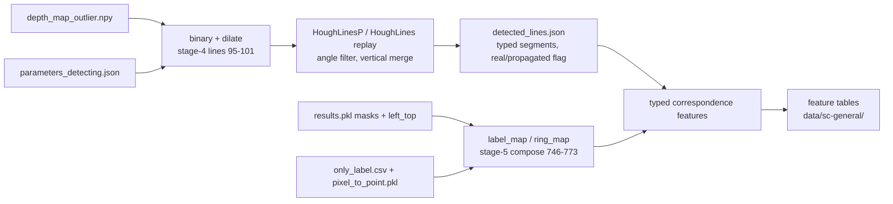

# SC-general roadmap: line <-> label-map correspondence features for the Proxy4Tun proxy

Three staged plans. Each stage ends at a decision gate; the next stage's plan is
written only after that gate is passed, carrying forward measured results rather
than assumptions. Status legend: `[ ]` pending, `[~]` in progress, `[x]` done.

- Stage 1 - Pilot (unattended): `[x]` gate PASS, 15/15 replay exact; report at `data/sc-general/pilot/report.md`
- Stage 2 - Scale and freeze (unattended): `[x]` ran; holdout fidelity miss vs published bar accepted; freeze `bo/sc_general/models.json` (pruned_lean); report `data/sc-general/stage2/report.md`
- Stage 3 - Refinement (label-free band): `[x]` 22/22 selected; panel mIoU 0.738→0.770; 27-subset 0.722→0.748; report `data/sc-general/stage3/report.md`. Manuscript edits still pending.

---

## Shared context (applies to all stages)

### Why the current SC group fails

Deployed lean proxy (`bo/full_stage/models.json`): `depth_nan_ratio`,
`denoise_retained_ratio`, `sam_fill_rate`, `det_row_residual_px`, `det_row_gated`.

In `bo/elegant/features.py::compute_row_features`:

- `det_row_residual_px` is hard-coded to `0.0` unless `k_row_gate.json` exists,
  which only happens under `uniform_k_snap` (continuous family). Non-zero in
  17/120 calibration runs; 0 for every staggered and complex run.
- `det_row_gated` is a 0/1 regime flag, not a coherence measurement.
- `det_row_y_std` clusters prompt Y to a fixed `k_row_pattern` (1123, 1553 px);
  meaningless for complex (irregular K positions).

For staggered and complex the SC contribution therefore reduces to
`sam_fill_rate`. Concrete failure: `5-1-f008` (mIoU 0.385) and `5-1-f000`
(mIoU 0.864) have `sam_fill_rate` 0.748 / 0.745 and `det_row_residual_px` 0 / 0.

The paper's "family reference statistics S_f" do not exist as an artefact:
`sam_ontology_divergence` uses a uniform prior over `segment_order`;
`phase_incoherence_deg` compares rings within the same run. The rewrite drops
the S_f dependency; new SC features use only the run's own artefacts plus
C = `segment_per_ring`.

### Core idea

Neither the SAM label map nor the line detections alone is the signal. Lines are
physical evidence of where joints are; the label map is the claim of where
boundaries are. Coherence = the two explain each other, matched by type
(oblique line <-> oblique K-joint boundary, horizontal line <-> horizontal block
boundary, vertical ring line <-> `ring_map` boundary).

### Data path (offline replay; no pipeline rerun for frozen runs)

Every stored run (120 calibration, 54 holdout, refinement rounds) keeps
`depth_map_outlier.npy`, its own `params/<run>/parameters_detecting.json`,
`only_label.csv`, `pixel_to_point.pkl`, and (where populated) `results.pkl`
with per-block crop masks, `left_top`, SAM `score` / `logit`.

- Hough replay reimplements `anchors/unified/4_detection.py` lines 95-333
  (read-only import of the logic; anchors are never edited). OpenCV
  `HoughLinesP` uses a fixed internal RNG, so replay is deterministic; verified
  against the stored `initial_points.csv`.
- `results.pkl` population: staggered 40/40, continuous 40/40, **complex 0/40**.
  The `only_label.csv` + `pixel_to_point.pkl` rasterisation is therefore the
  primary label-map path for complex and must be validated against the
  `results.pkl` composition on a populated run.

### Protections (all stages)

- Never write into `anchors/`, `data/anchors/`, `data/bo/`, `data/baseline`, or
  overwrite `bo/full_stage/models.json`.
- New code: `bo/sc_general/`. New data: `data/sc-general/` and
  `data/<subset>-scgen-refinement/`.
- Single-instance validation before any bulk run, logged with case id, command,
  metrics, pass/fail criteria, output path.

---

## Stage 1 - Pilot

Goal: decide which correspondence features carry information about mIoU across
all three families before computing anything at scale.

### 1.1 Tooling (`bo/sc_general/`)

- `lines_replay.py`: rebuild binary/dilated edge map and Hough lines from
  `depth_map_outlier.npy` + the run's own `parameters_detecting.json`; keep type
  tags (`oblique_pos`, `oblique_neg`, `horizontal`, `vertical`) and a
  `real` / `propagated` flag; write `detected_lines.json` to a shadow dir
  `data/sc-general/replay/<run_id>/`.
- `label_map.py`: compose `label_map` / `ring_map` from `results.pkl`
  (stage-5 logic) when populated; otherwise rasterise `only_label.csv`
  (`pred_labels`, `pred_rings`) through `pixel_to_point.pkl` onto the depth-map
  grid and close small holes. Record which source was used.
- `features.py`: candidates below; `SC_GENERAL`, `SC_LEGACY`, `EVIDENCE` tuples.
- `overlay.py`: PNG of depth map + label boundaries + typed lines with
  matched / unmatched pixels coloured.

### 1.2 Candidate features

Correspondence (primary):

- `line_explained_frac`: fraction of detected joint-line length (oblique +
  horizontal, real detections only) within delta px of a block boundary of the
  matching orientation.
- `boundary_explained_frac`: fraction of block-boundary length within delta px
  of a matching-type line or, failing that, the dilated depth-edge map.
- `correspondence_f1`: harmonic mean of the two.
- `ring_line_offset_px`: median offset between merged vertical ring lines and
  the nearest `ring_map` boundary, normalised by ring width.
- `boundary_line_chamfer_px`: symmetric Chamfer distance between line pixels and
  block-boundary pixels (delta-free).
- `prompt_containment`: fraction of real-detection prompt points inside a block
  mask whose boundary is within delta of the generating line.

Regularity (secondary):

- `mask_fragmentation`, `boundary_straightness`, `block_height_dispersion`,
  `ring_label_completeness`.

Delta sweep: {8, 15, 25} px on the depth-map grid; keep the most stable.

Retained existing SC: `sam_fill_rate`, `sam_ontology_divergence`,
`phase_incoherence_deg`. K-row trio kept only as the `SC-legacy` comparison arm.

### 1.3 One-instance gate (`data/sc-general/gate.md`)

Case `data/anchors/5-1` (complex):

- replayed prompt points match `initial_points.csv` within 1 px, all rows;
- fallback label map coverage >= `sam_fill_rate`; on a populated continuous run
  (`3-1`) the fallback and `results.pkl` compositions agree pixel-wise on the
  labelled area;
- all candidate features finite.

Stop and debug if any item fails.

### 1.4 Cross-family pilot (`data/sc-general/pilot/`)

Fifteen frozen calibration trials, five per family, stratified on GT mIoU:

- staggered: `2-1-f019` (0.032), `2-1-f009` (0.159), `2-1-f002` (0.663),
  `2-1-t012` (0.827), `data/anchors/2-1` (0.874)
- continuous: `3-1-t025` (0.044), `3-1-t010` (0.109), `3-1-f005` (0.268),
  `3-1-t029` (0.725), `3-1-t015` (0.852)
- complex: `5-1-t002` (0.036), `5-1-f008` (0.385), `5-1-f018` (0.573),
  `5-1-t004` (0.786), `5-1-f000` (0.864)

Paths resolve through `bo/full_stage/training_table.csv` (`path` column).

Outputs: `pilot_features.csv` (15 runs x candidates x delta), 15 overlay PNGs,
`report.md` with per-feature per-family Spearman vs mIoU, sign consistency,
correlation with `sam_fill_rate` / `depth_nan_ratio`, and the
`5-1-f008` vs `5-1-f000` gap.

### 1.5 Stage-1 gate (decision with the user)

A feature goes forward if: same sign in all three families, |rho| >= 0.5 in at
least two, |corr| with existing lean features < 0.8. If no correspondence
feature passes, stop and revisit definitions; do not scale. Output of the gate:
the SC-general feature list and delta that Stage 2 will use.

---

## Stage 2 - Scale and freeze

Goal: recompute the chosen features for the frozen 120 calibration and 54
holdout runs, refit and ablate, freeze a new lean proxy. Written in detail
after the Stage-1 gate; skeleton:

### 2.1 Feature tables

- `build_tables.py`: extend the 120 rows of `bo/full_stage/training_table.csv`
  and the 54 rows of `bo/full_stage/holdout_scores.csv` with SC-general
  columns; recompute legacy features via `extract_lean` for consistency.
- Outputs: `data/sc-general/training_table.csv`, `holdout_table.csv`,
  `replay_audit.csv` (prompt-point match, label-map source per run).

### 2.2 Fit, ablate, freeze

- Reuse `fit_ridge`, `leave_one_family_out_cv`, `permutation_control`,
  `prune_tiny` from `bo/full_stage/train_proxy.py`.
- Arms: `P(e)`, `P(c-legacy)`, `P(c-general)`, `P(e+c-legacy)` (current),
  `P(e+c-general)`, lean `P(e+c-general)`; leave-one-feature-out; per-family refit.
- Trace which package produced the paper's calibration numbers
  (`bo/full_stage/models.json` says train MAE 0.129 / rho 0.853; paper says
  0.098 / 0.877) so the new numbers follow the same protocol.
- Freeze to `bo/sc_general/models.json`.

### 2.3 Holdout paired degradation

- 54 runs: Spearman + bootstrap CI, MAE per family, PairRank (27), alarm P/R at
  0.5, pooled vs per-family Wilcoxon. Mirror `bo/full_stage/score_holdouts.py`
  and `per_family_refit.py`.
- Outputs: `data/sc-general/holdout_scores.csv`, `validation_gate.md`.

### 2.4 Stage-2 gate

Lean general set: LOFO Spearman >= 0.678 (current lean), complex-family MAE not
worse than current, no K-row feature, holdout PairRank and alarm recall not
worse than 27/27. Output: frozen proxy package + scaled scorer for Stage 3.

---

## Stage 3 - Refinement and manuscript

Goal: rerun the Fable-5 refinement arm with the new frozen proxy and update the
paper. Written in detail after the Stage-2 gate; skeleton:

### 3.1 Refinement (Fable 5 only; GPT-5.6 arm dropped or re-scored as footnote)

- `bo/sc_general/score_scaled.py`: clip-to-[0,1] and bands as in
  `bo/proxy_scale/score_scaled.py`, backed by `bo/sc_general/models.json`.
- Re-derive the panel: anchor runs with new proxy in [0.5, 0.7] and GT mIoU
  < 0.7 (`bo/proxy_scale/band_check.py` pattern).
- Three rounds per panel case via the Cursor Fable-5 protocol
  (`data/bo/reflect/campaign_cursor2.md`), agent context exposing SC-general
  features; outputs under `data/<subset>-scgen-refinement/round{1,2,3}/`.
- Selection = highest new proxy including the start; offline GT afterwards.
- Recompute 27-subset anchor / +Bayesian / +refinement means.

### 3.2 Figures and manuscript (`paper/Proxy4Tun_manuscript/main.tex`)

- Regenerate `figs/ablation_results.pdf`, `figs/refinement_results.pdf`
  (plotters in `bo/bayes`; fix `MANUSCRIPT_FIGS` in `bo/paths.py` now that the
  manuscript lives under `paper/`).
- Abstract, highlights, contributions: feature count and numbers.
- PQ/SC section + Table candidate-features: replace K-row rows with
  correspondence rows; remove the S_f sentence; Algorithm 2 drop `S_f`.
- Results: lean-proxy equation; Tables proxy-calibration, holdout-fidelity,
  ablation-results (SC-legacy vs SC-general arms), unified-vs-perfamily,
  poc-model-compare (Fable only), panel-miou; Appendix poc-selection.
- Discussion / Conclusions: reframe finding 1 as layout-free mask-line
  coherence transferring across families including complex; limitations drop
  the K-row caveat, note the label-map fallback for runs without `results.pkl`.

### 3.3 Stage-3 gate

Manuscript compiles with all numbers traceable to `data/sc-general/` outputs.

---

## Decision log

| Date | Decision |
|---|---|
| 2026-09-12 | Offline replay from stored artefacts for the 120 + 54 frozen runs (no pipeline rerun). |
| 2026-09-12 | Refinement: full rerun of the Fable-5 arm only; GPT-5.6 arm dropped or re-scored as footnote. |
| 2026-09-12 | Features must capture the line <-> label-map matching relationship, not either artefact alone. |
| 2026-09-12 | Pilot on stratified trials from all three families before any scaling. |
| 2026-09-12 | Work split into three staged plans with gates between them. |
| 2026-09-12 | Stage 1 result: `correspondence_f1` (typed line<->boundary F1) is the strongest family-agnostic SC signal (pooled rho 0.83, complex rho 1.00, LOO Ridge 0.47 -> 0.90 vs legacy lean). Recommended Stage-2 SC-general candidates: `correspondence_f1@15`, `line_explained@15`, `boundary_explained_line@15`, `boundary_explained_edge@25`, `chamfer_sym_px`; add `ring_count_error` to PQ. Dropped: transition validity, prompt hits, straightness, ring-line features, sam_score (no SAM in complex). |
| 2026-09-12 | Finding: complex-family labels come from `geometric_segment` (tiling from detected K row), not SAM; `results.pkl` empty for all complex runs. Manuscript pipeline description must reflect this. |
| 2026-09-12 | Stage 2 data provenance correction: paper 120+54 = `bo/bayes` (not `bo/full_stage`). Lean-10 pool (K-row removed). Feature tables PASS (174/174 replay). |
| 2026-09-12 | Stage 2 train: LOFO-chosen `pruned_lean` = `{correspondence_f1@15, sam_fill_rate, ring_count_error, depth_nan_ratio}`; LOFO Sp **0.828** (pub 0.678); perm PASS. Legacy arm reproduces pub train/LOFO. |
| 2026-09-12 | Stage 2 gate **FAIL**: holdout Sp 0.817 / MAE 0.109 vs pub 0.827 / 0.086. PairRank 27/27; alarm 27/0 only for τ≤0.43 (FP@0.5 on 3-2,3-5,4-4). No SC-general arm clears holdout bar. Refine band 6/9 paper panel. Stop for decision — see `data/sc-general/stage2/report.md` §5. |
| 2026-09-12 | Stage 3 proceed with SC-general pruned_lean despite Stage-2 holdout miss. Panel rule change: proxy ∈ [0.5, 0.7] **without** GT mIoU < 0.7 filter (deployment-honest). Yields 22/27 anchors. |
| 2026-09-13 | Stage 3 complete: 22×3 rounds under `data/<S>-scgen-refinement/`; gate PASS on 3-4; serial GPU queue. Panel mean mIoU **0.738→0.770** (14/22 refined); 27-subset **0.722→0.748**; GT-good harm 5/16 (mean Δ −0.008); paper-overlap 6 cases 0.592→0.696. Continuous family mostly kept anchor (recipes did not beat SC-general proxy). Report: `data/sc-general/stage3/report.md`. |
